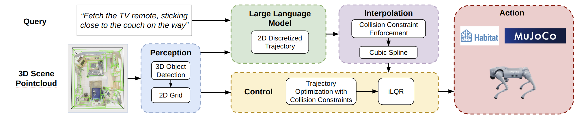
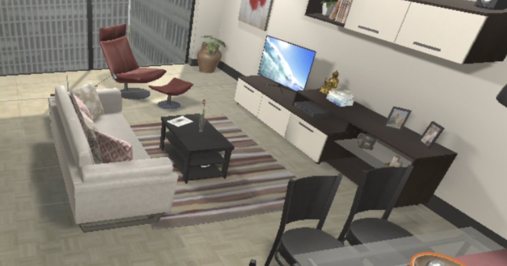
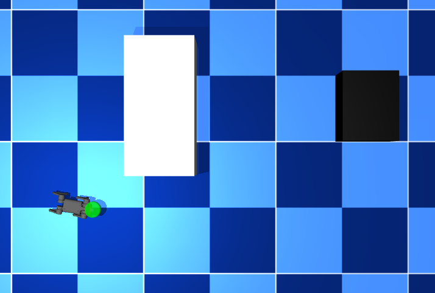

# Language-guided Quadruped Trajectory Generation and Control in Indoor Environments

A pipeline for translating trajectory-referential language into quadruped trajectories in indoor environments. See the writeup in [writeup/LANTRA.pdf](writeup/LANTRA.pdf) for more details.



## Installation

This repository is built on top of [MuJoCo MPC](https://github.com/google-deepmind/mujoco_mpc).

1. Clone [MuJoCo MPC](https://github.com/google-deepmind/mujoco_mpc):
    ```bash
    git clone https://github.com/google-deepmind/mujoco_mpc
    ```
2. After cloning and assuming you have cloned into the folder `mujoco_mpc`, modify the following lines in the following files to avoid a GRPC message size error when running quadruped control:

    1. Line 51 in [`mujoco_mpc/mjpc/grpc/agent_server.cc`](mujoco_mpc/mjpc/grpc/agent_server.cc#L51)
    2. Line 46 in [`mujoco_mpc/mjpc/grpc/direct_server.cc`](mujoco_mpc/mjpc/grpc/direct_server.cc#L46)
    3. Line 46 in [`mujoco_mpc/mjpc/grpc/filter_server.cc`](mujoco_mpc/mjpc/grpc/filter_server.cc#L46)
    4. Line 53 in [`mujoco_mpc/mjpc/grpc/ui_agent_server.cc`](mujoco_mpc/mjpc/grpc/ui_agent_server.cc#L53)

    from
    ```cpp
    builder.SetMaxReceiveMessageSize(40 * 1024 * 1024);
    ```
    to
    ```cpp
    builder.SetMaxReceiveMessageSize(1024 * 1024 * 1024);
    ```
3. Build MuJoCo MPC along with the Python API using the [instructions in the repo](https://github.com/google-deepmind/mujoco_mpc?tab=readme-ov-file#installation).
3. Install the requirements:
    ```bash
    pip install -r requirements.txt
    ```

## Usage

Create a [Mistral free API key](https://mistral.ai/) and set it as an environment variable:
```bash
export MISTRAL_API_KEY=YOUR_API_KEY
```

Run main.py:
```bash
python main.py --enforce-full-sparse-trajectory-collision --traj-save-name trajectory --robot-start 0 0 0
```

When prompted, give a language instruction, such as "Go to the TV, passing by the sofa." Only a simple example scene with a TV and a sofa is implemented.

<div style="display: flex; justify-content: space-between;">
    
    
</div>

## Note

This project is a proof of concept. Many features are yet to be implemented, including:
- Prompting for more complex scenes
- Visualization using Open3D
- Bug fixes for trajectory optimization for much longer or much shorter trajectories